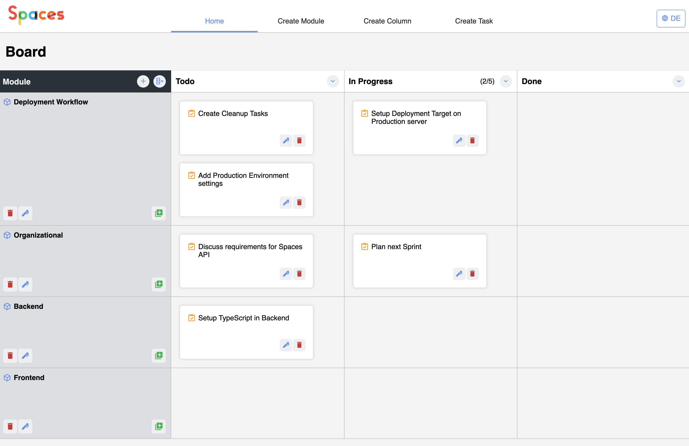

# Spaces - Kanban Board
A lightweight flexible Kanban Board Application made with Angular, Node.JS and MongoDB.

### Features
- Flexible creation of columns, tasks and modules within the application
- Rearrange tasks within a module via drag and drop
- Set task limits for specific columns
- Quick action widgets for creating the first columns and modules
- Mobile friendly



### Compatibility
*Desktop*
Developed and tested with Chromium Browsers.

*Mobile*
Tested with iOS Devices.

### Contribute / How to get the app running?
*Prerequisites*
- Docker installed and running
- Node.js installed

To run this project locally, follow these steps:

1. *Start the MongoDB*  
    ```bash
    # - via Docker/Docker Compose
    cd ./backend
    docker compose up -d
    ```

2. *Start the Backend*  
    ```bash
    cd ./backend
    npm start
    ```

3. *(Optional) Set the backend URL in the frontend (`./frontend/src/environments/environment.ts`)*  
    The default is `http://localhost:3000`.
    If you plan to run the backend on a different location, change this to your needs.
    
4. *Start the Frontend*
    ```bash
    cd ./frontend
    npm start
    ```

### Frontend Deployment

1. Compile the frontend via `npm run build:prod`

2. *Hosten the sources, e.g. with `http-server`:*
    ```bash
    cd ./frontend/dist
    http-server -p 8080 spaces
    ```